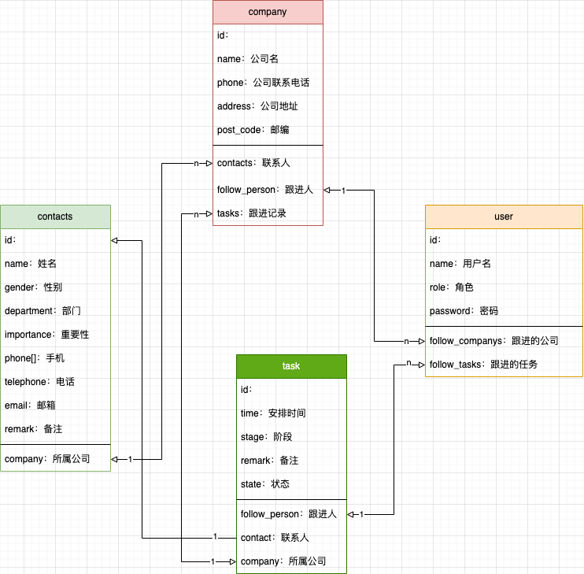

### 1、概述
+ CRM系统demo
+ 整体流程：
	+ 进入系统添加公司：每个公司相当于一个用户，有负责对接的处理人
	+ 点击公司名称进入对于的详情单，公司有自己的联系人，不属于本系统的用户
	+ 每个公司有自己的跟进记录，跟进记录：相当于一条任务，任务有自己的跟进人，任务可编辑信息
	+ 每个公司可以修改基本信息
	+ 删除公司后，自动同步删除该公司下的联系人和跟进任务
	+ 公司表、联系人表、跟进记录表
	+ 跟进任务一旦标记为完成便不可被删除
+ 实现登录为加分项
### 2、优先级
+ ==公司列表的增删改查（高优先）==
+ ==公司添加联系人（高优先）==
+ ==公司添加跟进任务（高优先）==
+ ==跟进任务的增删改查（高优先）==
+ ==跟进任务状态转变（可批量完成）（高优先）==
+ 登录的账号验证（低优先）
### 3、功能矩阵
#### 3.1、首页
+ 公司列表页的展示，做分页（可自定义几条），（当前页，页面数）
+ 刷新按钮（可复用接口）
+ 添加公司
	+ 最小参数：
		1. 公司名称
+ 单个公司的增删改查
#### 3.2、公司详情页
+ 获取公司的详细信息
+ 下有两个子页面
	+ 联系人（默认页）
		+ 只展示公司联系人
	+ 跟进记录
		+ 跟进任务的增删改
## 4、数据结构设计
